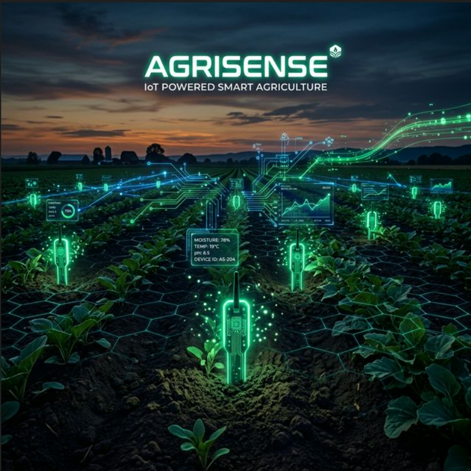
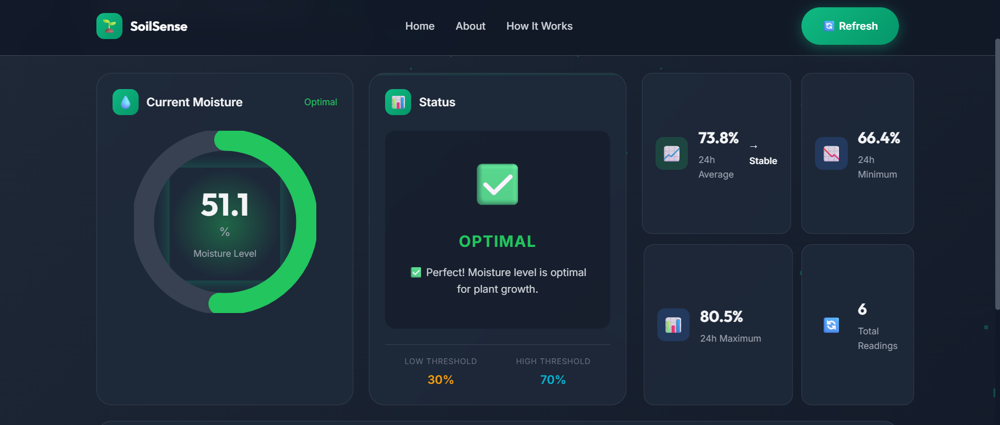

<div align="center">

# 🌱 Smart Soil Moisture Monitoring System

[](https://opensource.org/licenses/MIT)
[](https://nodejs.org/)
[](https://firebase.google.com/)
[](https://threejs.org/)

An IoT-based real-time soil moisture monitoring system featuring a stunning 3D interactive web interface, data visualization, and smart alerts.



</div>

---

## 🌟 Key Features

- **📡 Real-time Monitoring**: Live soil moisture readings continuously synced from IoT sensors.
- **🎨 3D Interactive UI**: Stunning Three.js animations and GSAP scroll effects for an immersive user experience.
- **📊 Beautiful Dashboard**: Animated circular gauges, live updating line charts, and dynamic status indicators.
- **🔔 Smart Alerts**: Instant notifications triggered when moisture drops to critical levels.
- **📱 Responsive Design**: Seamlessly adapts to both desktop and mobile devices.
- **⚡ Firebase Integration**: Robust real-time database ensuring rapid and seamless data synchronization.

---

## 📷 IoT Hardware Sensor

<div align="center">
  
  <p><em>Capacitive Soil Moisture Sensor (ESP32-based) deployed in a crop field</em></p>
</div>

### 🔧 Components Needed
- **ESP32 or ESP8266** microcontroller board
- **Capacitive Soil Moisture Sensor v1.2**
- Jumper wires and Breadboard
- Power supply (USB or battery bank)

### 🔌 Wiring Diagram

| Sensor Pin | ESP32 Connection |
| :--- | :--- |
| `VCC` | `3.3V` |
| `GND` | `GND` |
| `AOUT` | `GPIO34` (ESP32) or `A0` (ESP8266) |

---

## 📸 Interface Preview

### 🏠 Home Page — 3D Interactive Landing

<div align="center">
  
</div>

---

### 📊 Real-Time Dashboard

<div align="center">
  
</div>

---

## 📁 Project Structure

```text
3D-DTI/
├── assets/                   # Images and media assets for this README
│
├── backend/                  # Node.js REST API & Firebase integration
│   ├── routes/               # Express endpoints (moisture.js)
│   ├── utils/                # Moisture logic & thresholds
│   └── server.js             # Main entry point
│
├── frontend/                 # Client-side web application
│   ├── index.html            # Landing page with 3D elements
│   ├── dashboard.html        # Live analytics dashboard
│   ├── css/                  # Styling & themes
│   └── js/                   # Three.js, GSAP, and Chart.js logic
│
├── iot/                      # Microcontroller code & testing tools
│   ├── esp32_moisture_sensor.ino  # Arduino firmware
│   └── data_simulator.js          # Mock data generator (for testing)
│
└── docs/                     # Additional documentation
```

---

## 🚀 Quick Start Guide

### Prerequisites
- [Node.js](https://nodejs.org/) (v16 or higher)
- A [Firebase account](https://console.firebase.google.com/) for real-time data
- Arduino IDE (if flashing the IoT firmware)

### 1. Clone & Install

```bash
git clone https://github.com/Umesh-369/AgriSense.git
cd AgriSense/backend
npm install
```

### 2. Configure Firebase

1. Create a Firebase project and enable the **Realtime Database**.
2. Go to **Project Settings → Service Accounts** and generate a new private key.
3. Save the file as `backend/serviceAccountKey.json`.
4. Copy the environment variables example and update your database URL:

```bash
cp .env.example .env
```

```env
FIREBASE_DATABASE_URL=https://your-project-id.firebaseio.com
```

### 3. Start the Server

```bash
npm start
```

> **Note**: Without Firebase configuration, the app runs in **Demo Mode** with simulated data.

Open in browser:
- 🏠 **Home:** [http://localhost:3000](http://localhost:3000)
- 📊 **Dashboard:** [http://localhost:3000/dashboard](http://localhost:3000/dashboard)

---

## 📊 API Endpoints Reference

| Endpoint | Method | Description |
|:---|:---|:---|
| `/api/health` | `GET` | Verifies server operational status |
| `/api/moisture/current` | `GET` | Fetches the latest moisture reading |
| `/api/moisture/history` | `GET` | Retrieves historical data (past 24h) |
| `/api/moisture/status` | `GET` | Calculates current status and alerts |
| `/api/moisture/thresholds` | `GET` | Returns threshold configuration data |

---

## 💻 IoT Hardware Setup Details

1. Open `iot/esp32_moisture_sensor.ino` in your **Arduino IDE**.
2. Install the **Firebase ESP Client** library by Mobizt via the Library Manager.
3. Update credentials:
   ```cpp
   #define WIFI_SSID      "your_wifi_name"
   #define WIFI_PASSWORD  "your_wifi_password"
   #define FIREBASE_HOST  "your-project.firebaseio.com"
   #define FIREBASE_AUTH  "your_firebase_secret"
   ```
4. Flash the code to your ESP32/ESP8266 board.

### 🧪 Testing Without Hardware

Use the included data simulator to generate realistic mock readings:

```bash
cd iot
node data_simulator.js
```

---

## 🎨 Technologies & Stack

| Category | Technologies Used |
| :--- | :--- |
| **Frontend UI/UX** | HTML5, CSS3, JavaScript (ES6+), Glassmorphism |
| **3D & Animation** | Three.js, GSAP (GreenSock) |
| **Data Visualization** | Chart.js |
| **Backend & API** | Node.js, Express.js |
| **Database** | Firebase Realtime Database |
| **IoT / Hardware** | C++ (Arduino), ESP32 / ESP8266 |

---

## 🤝 Contributing

Contributions, issues, and feature requests are welcome!
Feel free to open an [issue](https://github.com/Umesh-369/AgriSense/issues) or submit a pull request.

## 📄 License

This project is [MIT](https://opensource.org/licenses/MIT) licensed.

---

<div align="center">
  <i>Designed & Developed with ❤️ for Smart Agriculture</i>
</div>
